# Image Mosaic Using homography

> This readme file is a summary of the project. For more details, please refer to the notebooks.

## Table of Contents


## Introduction
- In this project, our goal was to develop an image stitcher, seamlessly combining two input images into a unified mosaic using image warping and homographies. We focused on mastering homogeneous coordinates and homography matrices, crucial for transforming and aligning images onto a shared plane. Employing Python and prominent computer vision libraries, we implemented a meticulous solution that computed homography matrices to warp one image into the perspective of another. The report encapsulates our experimental setup, image selection rationale, and the analysis of results, highlighting the effectiveness of our solution in achieving seamless image integration

## Steps 
### Getting Correspondances
- In the project's initial phase, we focused on pinpointing key corresponding points by plotting and clicking on distinctive features in both images. This step is crucial because we need at least four accurate correspondences to calculate the homography matrix effectively. The precision of these chosen points directly impacts the final mosaic's accuracy and coherence. By deliberately selecting recognizable features present in both images, we aimed to facilitate the creation of a seamless mosaic. This emphasizes the significance of this initial step, as the success of subsequent image alignment and stitching directly hinges on the accuracy of these identified correspondences.

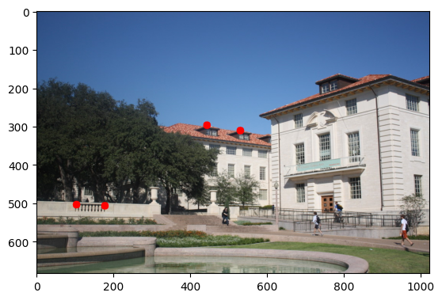
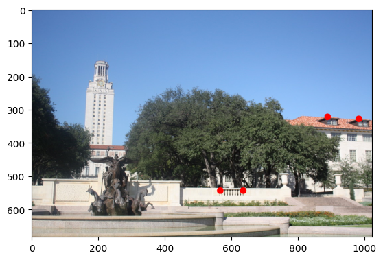


### Getting Homography matrix
- To facilitate the computation of homography parameters, we developed a function designed to take a set of corresponding image points and derive the associated 3x3 homography matrix, denoted as H. This matrix plays a pivotal role in transforming any point, represented as p in one view, to its corresponding homogeneous coordinates, p', in the second view. The function expects a list of n (where n is greater than or equal to 4) pairs of corresponding points from the two views, each specified with its 2D image coordinates. Utilizing a system of linear equations Ax = b, we stack the 8 unknowns of H into an 8-vector x, where the 2n-vector b contains image points from one view, and the 2n x 8 matrix A is appropriately filled. The resulting system, λp = Hp, with H3,3 set to 1, allows us to solve for the unknown homography matrix parameters. This function lays the foundation for accurate homography computations essential for subsequent image transformations and mosaics.

- In this part choosing the points where very critical as by shifting one point the warped image could be affected highly.
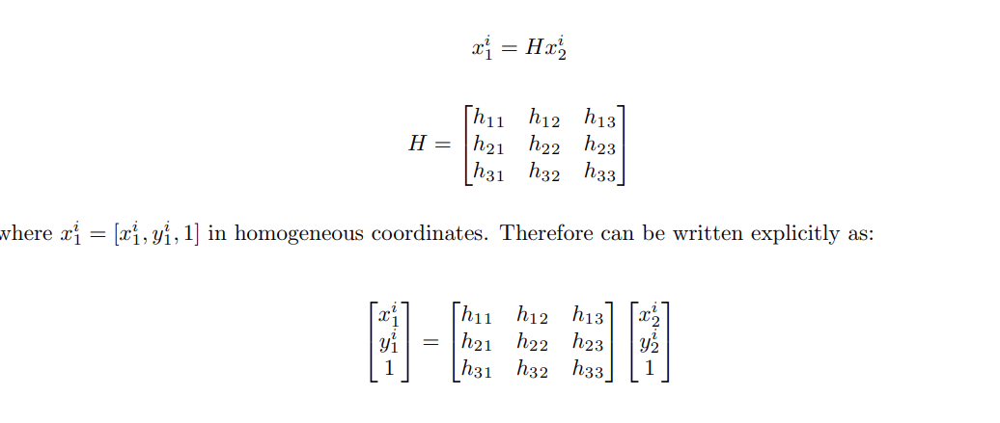
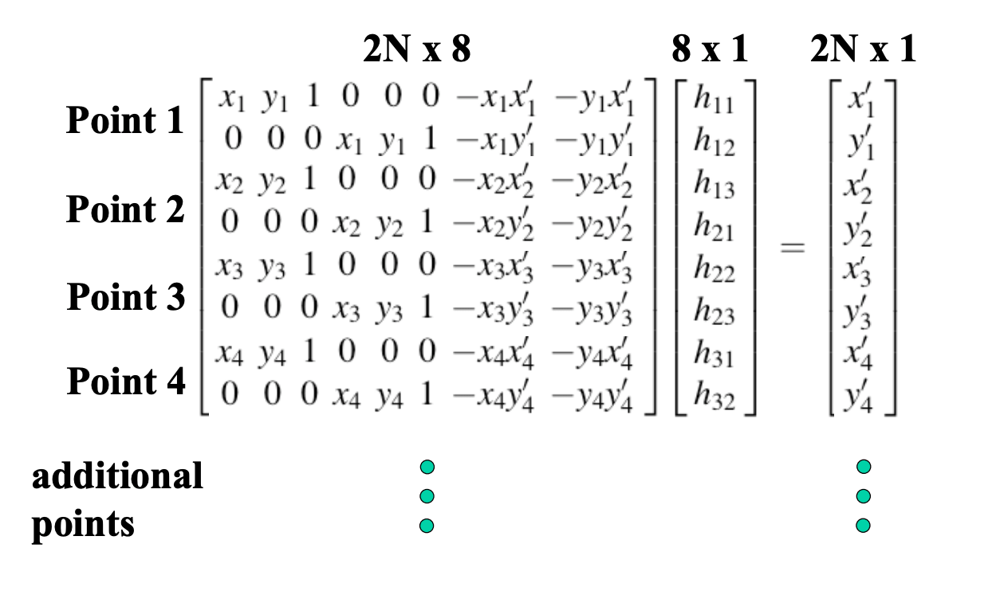
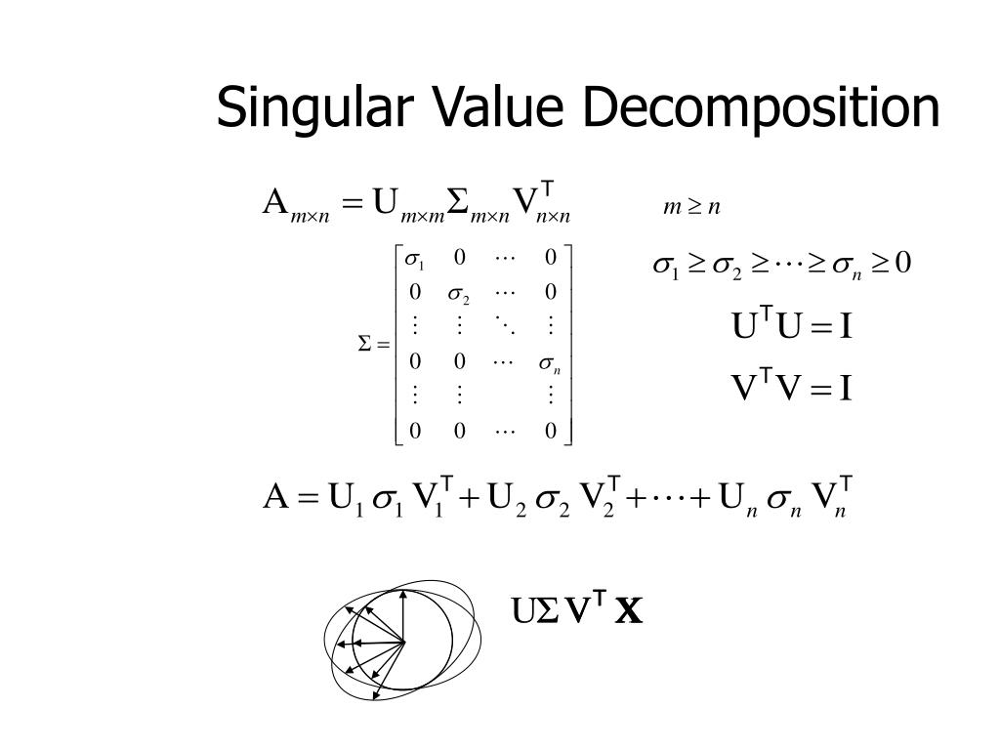


### Image Warping
- The developed function plays a pivotal role in transforming images based on a recovered homography matrix. Taking the homography matrix and an input image as inputs, the function performs an inverse warp to avoid creating holes in the output. By warping points from the source image into the reference frame of the destination, the function computes the bounding box in the new reference frame. This bounding box defines the region to sample pixel values from the source image, with interpolation used to maintain smooth transitions. For color images, the function warps each RGB channel independently and then combines them to form the final output. This approach ensures the preservation of image details during the transformation process, allowing for the generation of a new image that faithfully represents the warped input.


- For this part we had two ways to perform same function one of the without using inverse warping as the pseudocode below.
### Algorithm
```
Warp Function Usage Steps:
Initialization:

Initialize the output image size.
Create arrays ret and ret_img to store count and sum values for each pixel in the warped image.
Obtain the input image shape.

Iterate Over Input Image:
Loop through each pixel in the input image.
Calculate the warped point (x, y) using the provided homography matrix H.

Determine Nearest Points:
Identify the four nearest points to the warped point (x, y) by considering the floor and ceiling values.
Remove duplicate points to ensure uniqueness.

Update Count and Sum Arrays:
For each of the nearest points:
Check if the point is inside the output image bounds.
Increment the count and add pixel values to the sum arrays for each color channel.

Calculate Averages:
Iterate over the output image size.

For each pixel and color channel:
Check if the count is non-zero.
Calculate the average value based on the accumulated sum and count.
Assign the computed average to the corresponding pixel in the output image.

Return Result:

The function returns the warped image (ret_img), where each pixel represents the average color value of the corresponding region in the input image after applying the homography transformation.
```


### Algorithm for Warping and Inverse Warping
```
Warp Inv Function Usage Steps:

Initialization:
Initialize an array ret_img to store the warped image.
Obtain the input image shape.

Forward Warping:
Loop through each pixel in the input image.
Calculate the forward warped point (x, y) using the provided homography matrix H.
Assign the color value of the input image at (i, j) to the corresponding location in the ret_img array.

Adjust Image Dimensions:
Crop the ret_img array to the desired output dimensions (e.g., trimming to a specific width and height).
Display the warped image using plt.imshow and plt.show.

Inverse Warping to Handle Holes:
Iterate over each pixel in the warped image.
Check if the pixel is black (indicating a hole).
If a hole is detected:
Perform inverse warping to find the corresponding point in the original image using the inverse of the homography matrix.
Calculate the 4 nearest points to the inverse warped point.
Update the pixel value in the warped image by averaging the values from the original image within the identified region.

Return Result:
The function returns the final warped image (ret_img) after handling both forward and inverse warping. This approach minimizes holes and inaccuracies in the output image, providing a more accurate representation of the transformed input.
```
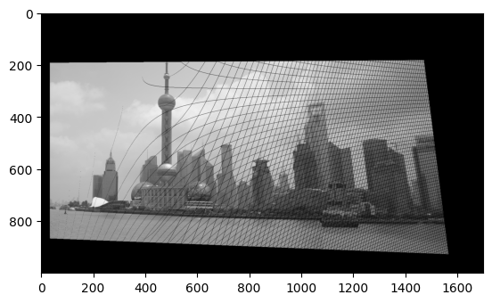
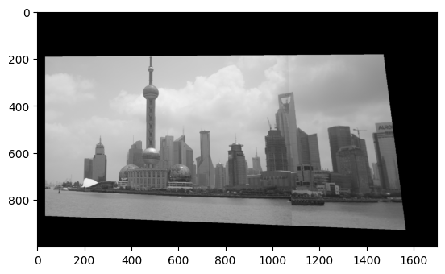


### Adding photos to make a Panorama
- In the process of combining a warped image with a main image, two efficient techniques were employed. The first technique utilized direct assignment and slicing, seamlessly integrating the warped image into a specified region of the main image. This straightforward approach ensures a concise and visually coherent result. The second technique involved conditional element-wise assignment, creating a new matrix that selectively incorporated pixels from either the warped or main image based on specific conditions. This method offers more control over the merging process, allowing for customization based on pixel values. Both techniques contribute to the successful fusion of images in the context of homography-based transformations, providing flexibility and clarity in the final output.
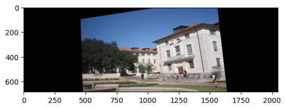
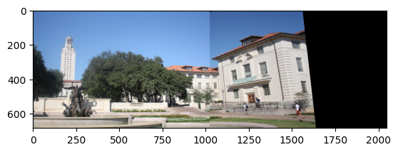

### BONUS
- We applied the exact same approaches as the first part

- Firstly we warped the right-most image to be with the left-most image
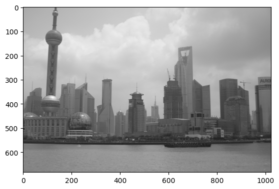
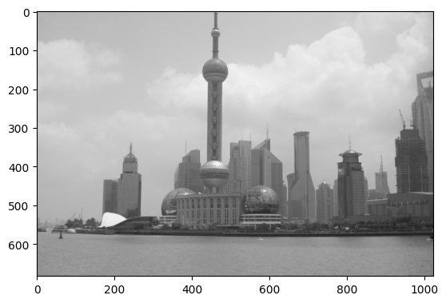
- Got Correspondances for the two image

- Calculated the Homography matrix

- warped the right-most one

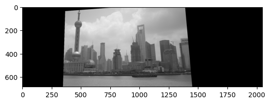
- Added them to one image

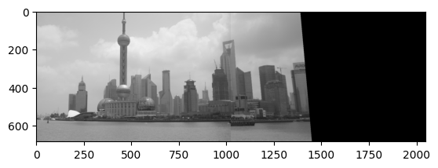


- Secondly we Warped the formed panorama to be added to the up-most image

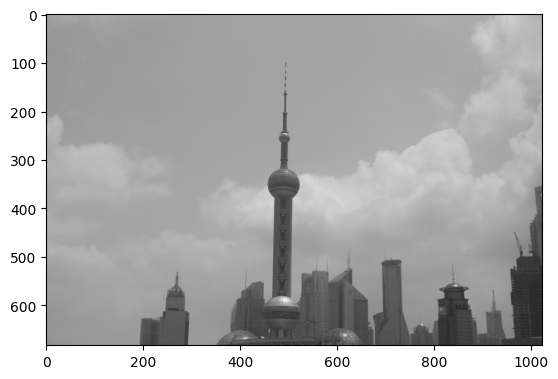


- Got Correspondances for the two image

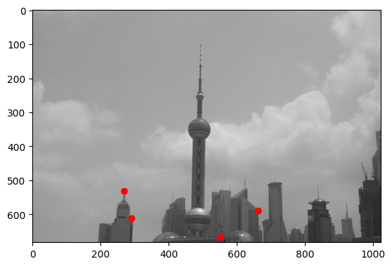
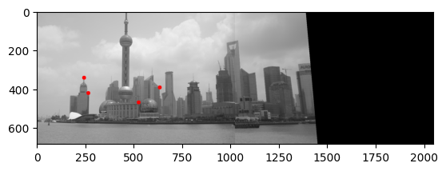

- warped the panorama one

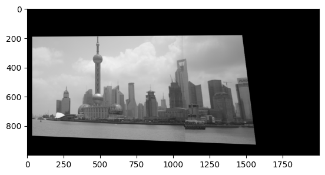

- Added them to one image

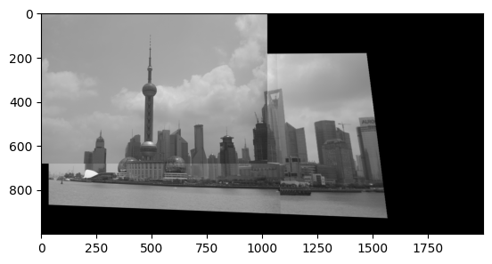


## Authors
- [Mohamed Farid](https://www.github.com/MohamedFarid612)
- [Yousef Kotp](https://www.github.com/yousefkotp)
- [Adham Mohamed](https://www.github.com/adhammohamed1)


